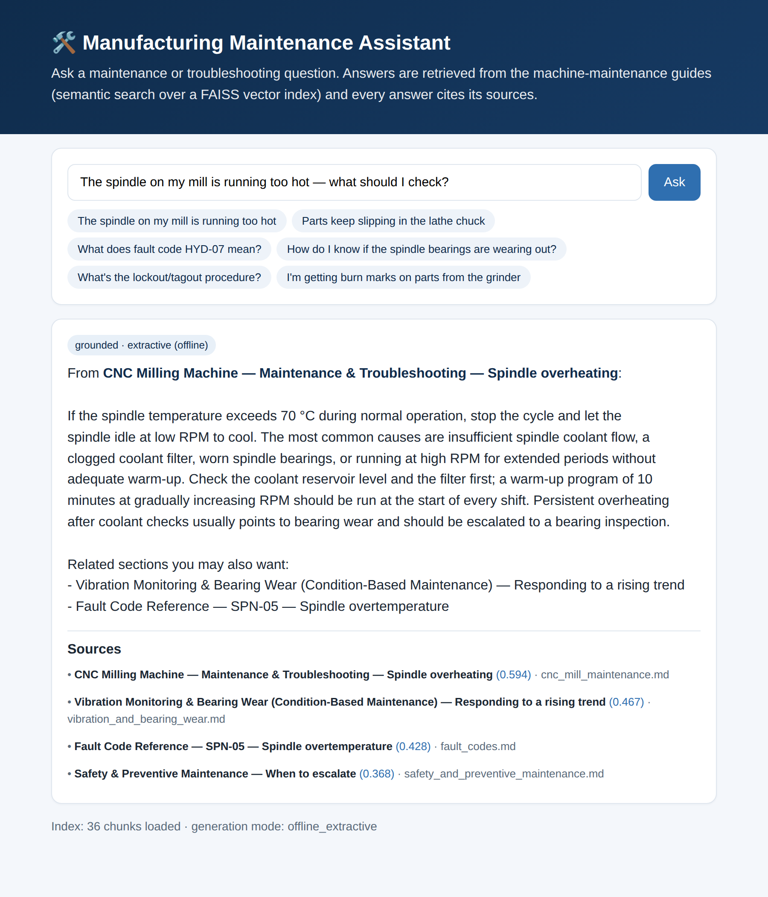

# Manufacturing Maintenance Assistant (RAG)

A retrieval-augmented question-answering service over a machine-maintenance knowledge base: ask a
troubleshooting question, get a **grounded, cited answer** drawn from the maintenance guides — never
an ungrounded guess. Built around a real vector database (FAISS) and, crucially, a **retrieval
evaluation harness**, because a RAG system is only as good as what it retrieves.

Anchored to the same Swiss precision-manufacturing domain as this portfolio's surface-defect and
factory-sensor projects — the same machine types and the same bearing-wear theme run through the
knowledge base, so the three projects read as one smart-factory suite.



## Why this exists

Anyone can wire up "embed, retrieve, and prompt an LLM." What separates a production RAG from a demo
is knowing *whether the retrieval is actually good* — and answering only from the documents. This
project does both: it **measures retrieval** on a labeled question set, and it **refuses to answer**
when nothing relevant is found rather than hallucinating.

It also follows this portfolio's signature pattern: a classical baseline measured honestly against
the fancier method. Here the retriever's embedder is the variable — a fully-offline **LSA baseline**
(what runs live) vs. **transformer embeddings** (the measured upgrade).

## Architecture

```
  maintenance guides  ──►  chunk by section  ──►  embed (LSA / transformer)  ──►  FAISS vector index
   (markdown)                                                                          │
                                                                                       ▼
   question  ──►  embed query  ──►  FAISS top-k retrieve  ──►  grounding guardrail  ──►  cited answer
                                                                (LLM if configured, else extractive)
```

The **generation** layer is a three-tier fallback (the same graceful pattern as this portfolio's
swiss-claims-assistant): Azure OpenAI → OpenAI → **offline extractive** (default). With no API keys
it still returns a useful, fully-cited answer synthesized directly from the retrieved passages, so
the live demo works with zero configuration.

## The knowledge base

Six maintenance guides covering CNC mills, lathes, hydraulic presses, and surface grinders, plus a
fault-code reference, a vibration/bearing-wear guide, and safety/preventive-maintenance procedures —
36 retrievable sections. (Synthetic but realistic reference content, not a real manufacturer's
manuals.)

## Two embedders, measured

The retriever's embedder is pluggable:

- **LSA (TF-IDF + Truncated SVD)** — a classical dense embedding learned from the corpus itself.
  Fully offline, no model download, tiny — this is what the **live service** uses.
- **Transformer (`sentence-transformers/all-MiniLM-L6-v2`)** — the measured upgrade, computed in the
  Colab notebook (the model hub isn't reachable from the build environment), evaluated identically.

## Retrieval evaluation (the "production" part)

Both embedders are evaluated the same way on a labeled set of **30 questions**, each mapped to its
known-relevant chunk(s), phrased with different wording than the source text to genuinely test
semantic retrieval.

| Metric | LSA baseline | Fine-tuned transformer (MiniLM) |
|---|---|---|
| MRR | 0.853 | _from Colab_ |
| hit@1 | 0.767 | _from Colab_ |
| hit@3 | 0.933 | _from Colab_ |
| hit@5 | 0.967 | _from Colab_ |
| recall@5 | 0.883 | _from Colab_ |

The classical LSA baseline is already strong — a relevant passage is in the top 3 for **93%** of
questions. The transformer column is filled in by running `notebooks/build_transformer_index.ipynb`
(it evaluates MiniLM on the same set and writes the comparison). LSA's known weak spot is
paraphrase/lexical collision — e.g. a terse "lockout tagout procedure" query gets pulled toward the
several sections that merely *mention* applying lockout/tagout — exactly where transformer embeddings
are expected to help, which is what makes the comparison worth doing.

`scripts/evaluate_rag.py` computes these and logs them to MLflow (same local-SQLite pattern as this
portfolio's other projects).

## The grounding guardrail

Before answering, the assistant checks that *something in the corpus is actually relevant* (a minimum
similarity). Ask it something off-topic ("what's the capital of France") and it says it has nothing
relevant rather than inventing an answer — the whole point of RAG is to answer from the documents.

## Running it

```bash
pip install -r requirements.txt
python scripts/build_index.py          # build the FAISS/LSA index (also committed)
uvicorn app.main:app --reload
```

Open `http://localhost:8000/` for the ask-a-question UI, or `/docs` for the API. To use a real LLM
for synthesis instead of the offline extractive answer, set `OPENAI_API_KEY` (or the `AZURE_OPENAI_*`
vars) — the service picks it up automatically.

### API

| Endpoint | Description |
|---|---|
| `GET /` | Ask-a-question UI |
| `GET /health` | Index status, chunk count, active generation mode |
| `GET /corpus` | The documents and section counts in the knowledge base |
| `POST /ask` | `{"question": "..."}` → grounded answer, `grounded` flag, generation `mode`, and cited `sources` |

### Retrieval evaluation

```bash
pip install -r requirements-eval.txt   # mlflow
python scripts/evaluate_rag.py
mlflow ui --backend-store-uri sqlite:///mlflow.db
```

### Tests

```bash
pytest tests/ -v
```

Covers chunking, FAISS retrieval quality (relevant chunk in the top-k for representative queries),
the grounded-answer + guardrail behavior, the retrieval-metric math, and the API end to end — all on
the offline LSA path, so CI needs no model download and no torch.

### Docker

```bash
docker build -t maintenance-rag .
docker run -p 8000:8000 maintenance-rag
```

Light image — the offline LSA service, ~150 MB resident, no torch.

### Live demo

Deployed on Render's free tier: **https://manufacturing-maintenance-rag.onrender.com/**. The free tier
spins down after 15 min idle, so the first request after a lull takes ~30–50s to wake.

## What I'd do next

- Fill in the transformer column (run the notebook) and, if it wins clearly, serve MiniLM query
  embeddings live via an ONNX export (the trick used in this portfolio's surface-defect project).
- Add answer-level evaluation (faithfulness / groundedness scoring), not just retrieval metrics.
- Chunk-overlap and hybrid retrieval (dense + BM25) for the paraphrase/lexical-collision cases.
